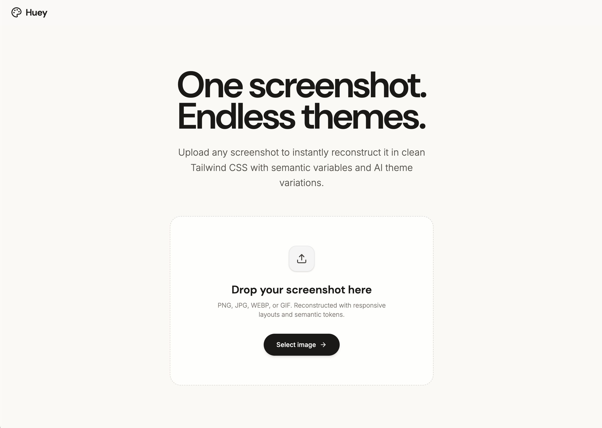

# Huey

> **One screenshot. Endless themes.**



Huey is an AI-powered design system assistant that transforms any UI screenshot into production-ready, semantic Tailwind CSS components and automatically generates harmonic color themes.

---

## ✨ Features

- **📸 Vision Reconstruction**: Upload any UI screenshot (PNG, JPG, WEBP) to recreate the layout in responsive Tailwind CSS using arbitrary semantic CSS variable tokens (e.g. `bg-[var(--bg-base)]`, `text-[var(--text-primary)]`).
- **🎨 Theme Engine**: Generates distinct, production-ready color themes with balanced visual hierarchy and WCAG contrast compliance.
- **🌗 Mode-Aware Generation**: Respects original UI mode—generating curated light themes for light mode designs and deep dark themes for dark mode designs.
- **💬 Conversational Palette Refinement**: Fine-tune colors naturally via interactive chat (e.g., *"make buttons terracotta"*, *"warm up the background surfaces"*).
- **🎛️ Live Visual Token Studio**: Real-time swatch editing, contrast analysis, responsive device preview (Desktop, Tablet, Mobile), and color temperature staging.
- **📦 Multi-Format Export**: Export as CSS custom properties (`:root`), Tailwind config, JSON tokens, or full standalone HTML/CSS code.

---

## 🚀 Quick Start

### Prerequisites

- [Node.js](https://nodejs.org/) (v18 or higher recommended)
- A Gemini API Key

### Installation

1. **Clone & Install Dependencies**
   ```bash
   npm install
   ```

2. **Configure Environment Variables**
   Create a `.env` file in the root directory (or use `.env.local`):
   ```bash
   GEMINI_API_KEY="your_gemini_api_key_here"
   ```

3. **Start the Development Server**
   ```bash
   npm run dev
   ```
   Open [http://localhost:3000](http://localhost:3000) in your browser.

---

## 🛠️ Tech Stack

- **Frontend**: React 19, TypeScript, Tailwind CSS v4, Motion, Lucide Icons
- **Backend**: Node.js, Express
- **AI / Vision**: `@google/genai` (Gemini Models)
- **Bundler**: Vite & tsx
